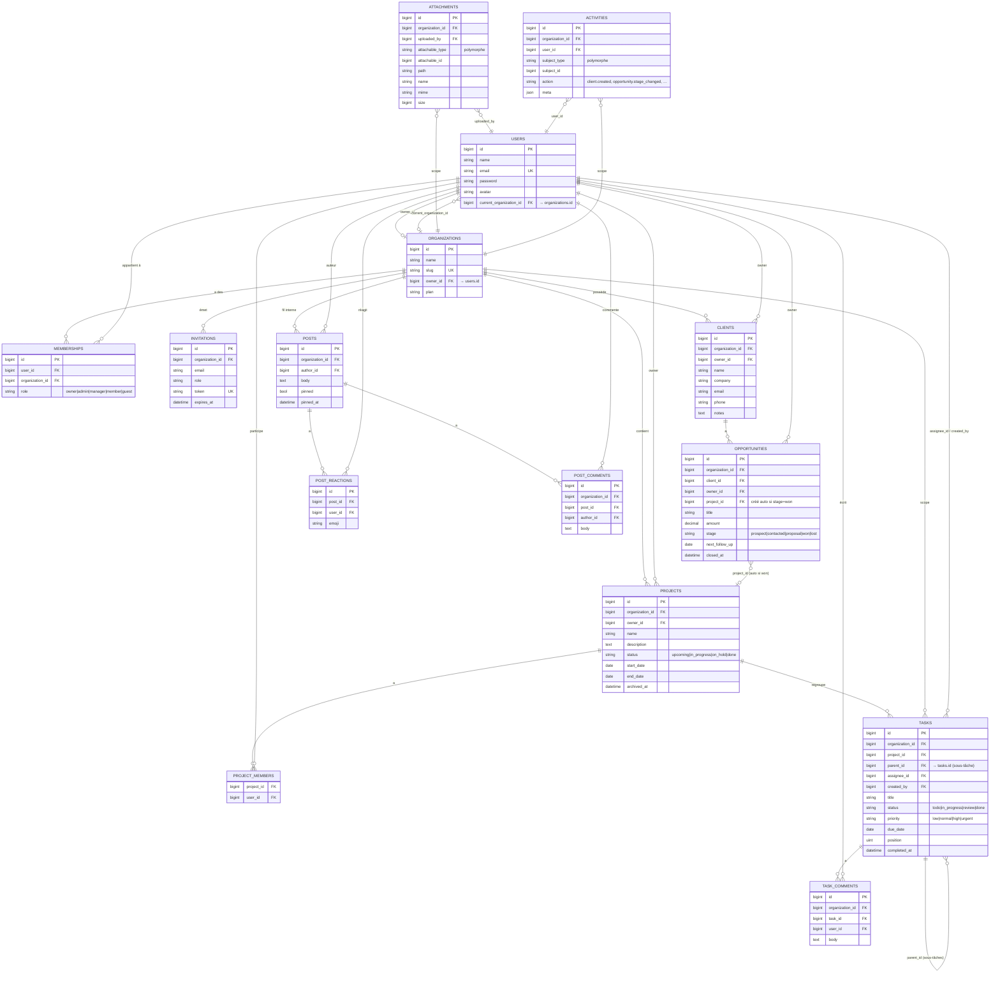
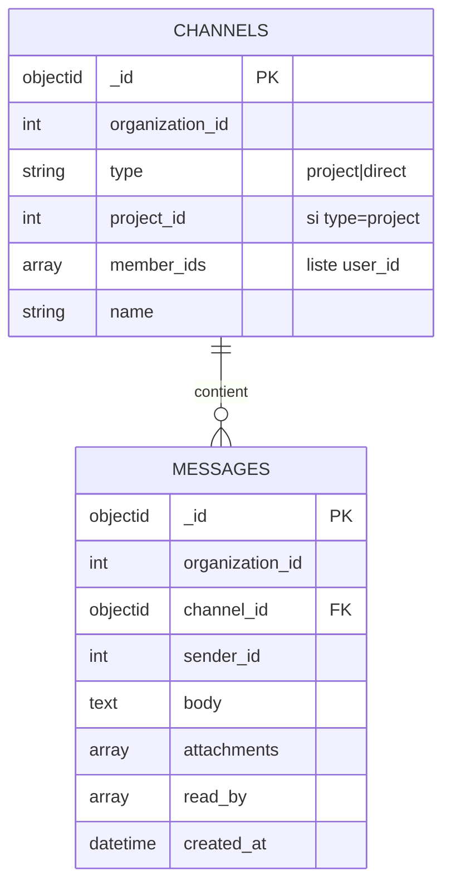
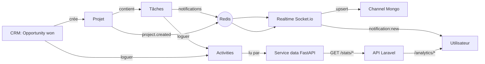

# TeamHub — Schéma de base de données

Diagramme généré d'après le code réellement commité (migrations + modèles Eloquent + collections MongoDB).

## Vue globale par module

## MongoDB (service realtime)

Les collections sont écrites par `apps/realtime` et synchronisées depuis Laravel via Redis pub/sub (`wine:project:events`).

## Règles clés par module

| Module | Scope automatique | Règle métier |
|---|---|---|
| M0 Core | — | 1 user peut appartenir à N orgs ; un `role` par (user, org) |
| M1 Projets | `organization_id` injecté par trait `BelongsToOrganization` | `project_members` filtre la visibilité pour `member` et `guest` |
| M1 Tâches | idem | `parent_id` → sous-tâches ; `assignee_id` doit être membre de l'org (validation serveur) |
| M3 CRM | idem | `opportunity.stage = won` → **crée automatiquement** un `project` lié (owner = user qui gagne) |
| M4 Social | idem | `pinned` réservé owner/admin ; réaction unique par (post, user, emoji) |
| Transverses | idem | `attachments` et `activities` sont polymorphes (clé `*_type` + `*_id`) |
| Chat (Mongo) | `organization_id` répliqué dans chaque document | Index composé `(organization_id, channel_id, created_at)` |

## Flux inter-modules

**Lecture rapide** :
- Chaque action métier (créer projet, gagner une opportunité, assigner une tâche) laisse une trace dans `activities` → alimente Analytics.
- Les événements temps réel (notification, création de projet) passent par Redis → relayés par le realtime en WebSocket.
- Le service `data` lit Postgres en direct, jamais exposé publiquement (secret interne).
